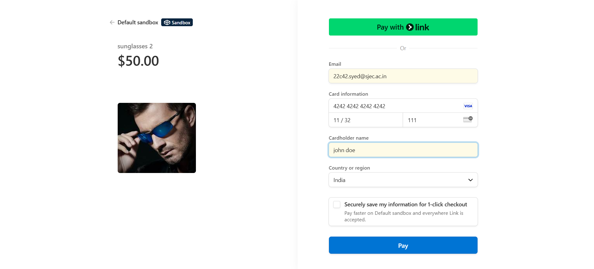
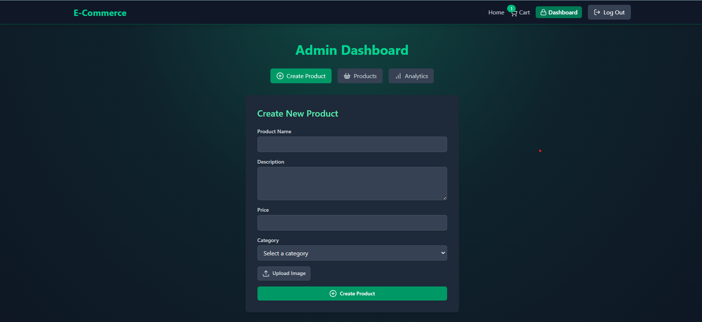
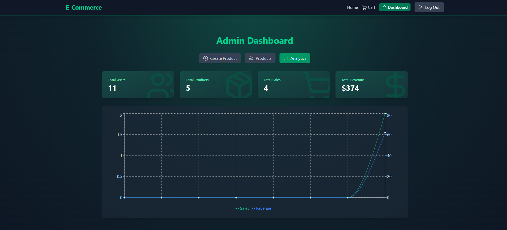
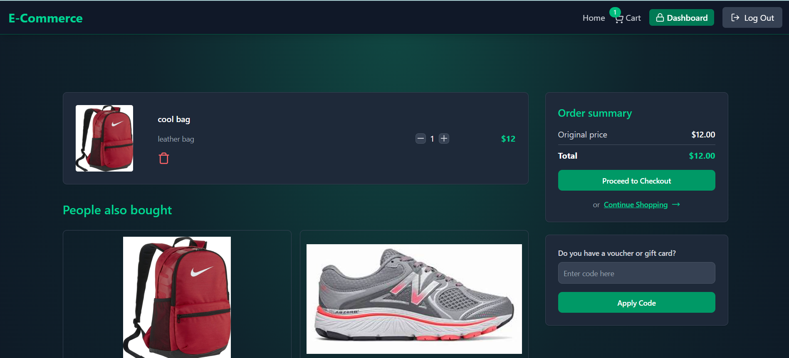

# 🛍️ Full-Stack E-Commerce Platform

A production-ready e-commerce web application featuring secure Stripe payment integration, discount code handling, real-time analytics dashboard, and seamless Docker-based deployment.

---

## 🚀 Features

- 🔐 Secure Stripe Payment Integration  
- 💸 Discount Code Support  
- 📊 Real-Time Dashboard Analytics  
- 📦 Product Management (Add/Edit/Delete)  
- 👤 User Authentication & Order History  
- 🐳 Dockerized for Deployment & Scalability  

---

## 📸 Screenshots

### 🛒 Home Page


### 🧾 Checkout with Stripe


### 📊 Admin Dashboard



### 📊 Analytics (past 7days)



### 📊 cart-checkout page



### 📊 Payment-success


### 📊 Admin Dashboard


---

## 🛠️ Tech Stack

**Frontend:** Reac  
**Backend:** Node.js / Express  
**Database:** MongoDB ,Redis  
**Payments:** Stripe API  
**Containerization:** Docker  
**Authentication:** JWT / OAuth  

---

## 🧰 Getting Started

### Prerequisites

- Node.js  
- Docker  
- MongoDB / PostgreSQL (or Dockerized version)

### Clone the Repo

```bash
git clone https://github.com/yourusername/ecommerce-platform.git
cd ecommerce-platform
